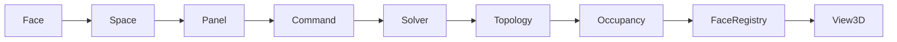

# Panel Add Pipeline（锚定板件统一链路）

系统正式进入 **配置驱动 + Role/Face 管线** 阶段：新增板件只改注册表，禁止复制 `left_panel` 代码。

## 链路



| 阶段 | 职责 | 模块 |
|------|------|------|
| **Face** | 悬停面 / 工具面 / payload | `panel_face_mapper`, `ui/interaction/face_interaction` |
| **Space** | 挂载目标叶空间 | `CommandFactory.resolve_attachment_space` |
| **Panel** | `PanelRoleSpec` → 构造 + 落位 | `panel_role_spec`, `cabinet_space_panel_cmd.build_side_panel` |
| **Command** | `AddBoardCommand` + UndoStack | `panel_pipeline.create_add_panel_command` |
| **Solver** | 脏空间求解 | `core/solver/incremental_solver` |
| **Topology** | 全量重建 | `rebuild_after_solver` |
| **Occupancy** | 空间 / 面占用 | `SpaceConsistencyManager.rebuild_occupancy` |
| **FaceRegistry** | LEFT/RIGHT 面登记 | `core/space/face_registry` |
| **View3D** | 增量绘制 | `SOLVE_COMPLETED` → `incremental_display` |

## 三件套（新增板件唯一入口）

1. **`PanelRole`** — `core/constants/enums.py`
2. **`PanelRoleSpec`** — `core/panel/panel_role_spec.py`（注册表）
3. **`panel_face_mapper`** — `core/panel/panel_face_mapper.py`（Face ↔ Role）

```python
# 示例：将来 TOP 板 — 仅加注册表 + 已有 build/solve 分发，无新 handler
PanelRoleSpec(
    face=FaceType.TOP,
    role=PanelRole.TOP,
    anchor=AnchorType.TOP,
    command_name="add_top_panel",
    label="顶板",
)
```

## 禁止

- `submit_add_left_panel` / `submit_add_right_panel` 并列 UI 入口（统一 `submit_add_panel_interaction(face=)`）
- `handle_add_left_panel` / `handle_add_right_panel` 独立 handler 文件
- `if face == LEFT` 颜色 / 占用 / 命令分叉（走 `process_face_hover` / `theme_constants`）
- 每种板件独立 Solver / Topology / View3D 刷新路径

## 参考

- `docs/ROLE_DRIVEN_PANEL_ARCHITECTURE.md`
- `core/panel/panel_pipeline.py`
